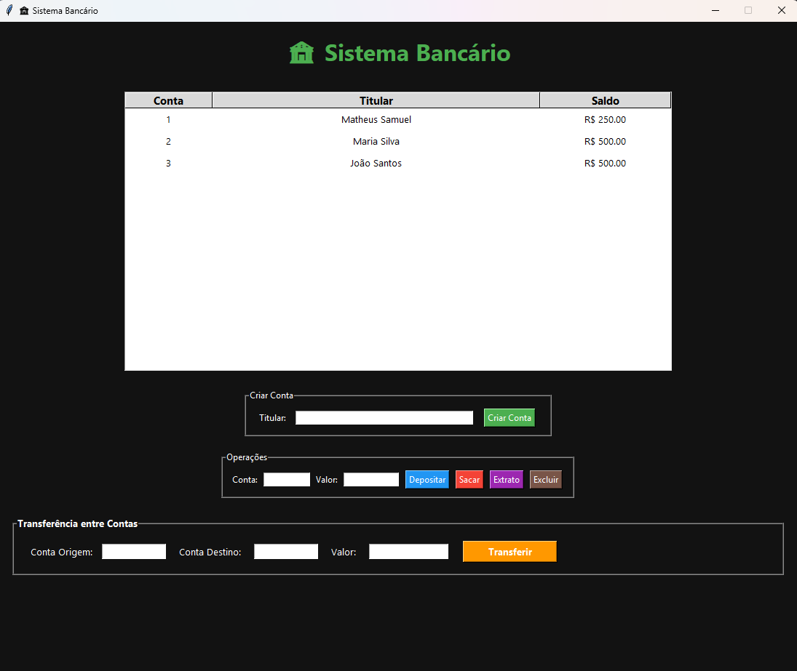

# 🏦 Sistema Bancário em Python

<p align="center">
  
  &nbsp;
  
  &nbsp;
  
</p>

<p align="center">
  
  &nbsp;
  
  &nbsp;
  
</p>

<p align="center">
  <strong>Sistema bancário desktop desenvolvido em Python para simular operações financeiras e praticar conceitos de Programação Orientada a Objetos e Interfaces Gráficas.</strong>
</p>

<p align="center">
  <a href="https://github.com/matheus-samuel-dev">GitHub</a>
  &nbsp;&nbsp;&nbsp;&nbsp;&nbsp;
  <a href="https://www.linkedin.com/in/matheus-samuel-dev">LinkedIn</a>
</p>

---

## 📖 Sobre o Projeto

Este projeto foi desenvolvido com o objetivo de aplicar conceitos fundamentais de desenvolvimento de software utilizando Python.

A aplicação simula operações bancárias através de uma interface gráfica intuitiva, permitindo o gerenciamento de clientes e movimentações financeiras.

Durante o desenvolvimento foram praticados conceitos como:

* Programação Orientada a Objetos (POO)
* Interface gráfica com Tkinter
* Manipulação de dados
* Organização de código
* Boas práticas de programação
* Tratamento de exceções

---

## ✨ Funcionalidades

### 👤 Gerenciamento de Clientes

* Cadastro de clientes
* Consulta de informações

### 💰 Operações Bancárias

* Depósitos
* Saques
* Transferências entre contas

### 📊 Controle Financeiro

* Consulta de saldo
* Extrato bancário
* Histórico de movimentações
* Registro das operações realizadas

---

## 🛠️ Tecnologias Utilizadas

### Linguagem

* Python

### Interface Gráfica

* Tkinter

### Ferramentas

* Git
* GitHub

---

## 📸 Demonstração do Sistema

<table>
<tr>

<td width="33%">

### 🏠 Tela Principal



</td>

<td width="33%">

### 🔄 Transferência


</td>

<td width="33%">

### 📄 Extrato Bancário


</td>

</tr>
</table>

---

## 🚀 Como Executar

### 1️⃣ Clone o repositório

```bash
git clone https://github.com/matheus-samuel-dev/sistema-bancario-python.git
```

### 2️⃣ Acesse a pasta do projeto

```bash
cd sistema-bancario-python
```

### 3️⃣ Execute a aplicação

```bash
python app.py
```

---

## 📂 Estrutura do Projeto

```text
sistema-bancario-python/
│
├── screenshots/
│   ├── tela_principal.png
│   ├── transferencia_entre_contas.png
│   └── extrato_bancario.png
│
├── app.py
├── README.md
└── demais arquivos do projeto
```

---

## 🎯 Objetivos do Projeto

* Praticar desenvolvimento desktop com Python
* Aplicar conceitos de Programação Orientada a Objetos
* Simular operações bancárias reais
* Aprimorar organização e arquitetura de software
* Desenvolver interfaces gráficas utilizando Tkinter

---

## 🚀 Melhorias Futuras

* [ ] Persistência de dados com SQLite
* [ ] Sistema de autenticação de usuários
* [ ] Exportação de extratos
* [ ] Relatórios financeiros
* [ ] Testes automatizados
* [ ] Interface aprimorada

---

## 👨‍💻 Autor

**Matheus Samuel**

Desenvolvedor em constante evolução, apaixonado por tecnologia e desenvolvimento de software.

Sempre buscando novos desafios para aplicar conhecimentos, aprender novas tecnologias e construir soluções que gerem valor.

<p align="center">
  <a href="https://www.linkedin.com/in/matheus-samuel-dev">LinkedIn</a>
  &nbsp;&nbsp;&nbsp;&nbsp;&nbsp;
  <a href="https://github.com/matheus-samuel-dev">GitHub</a>
</p>
