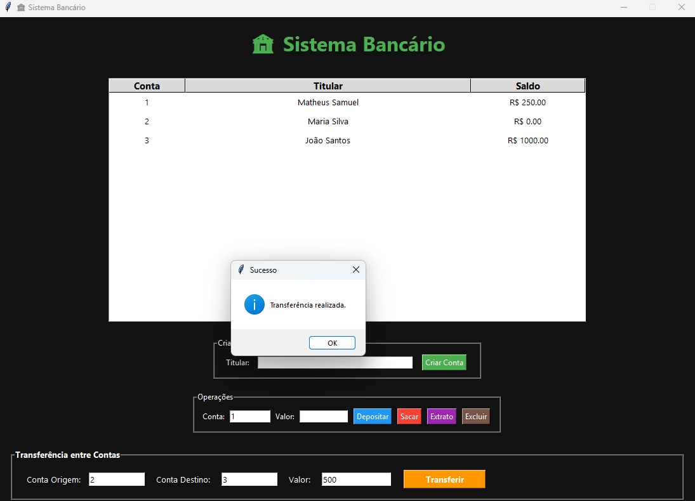
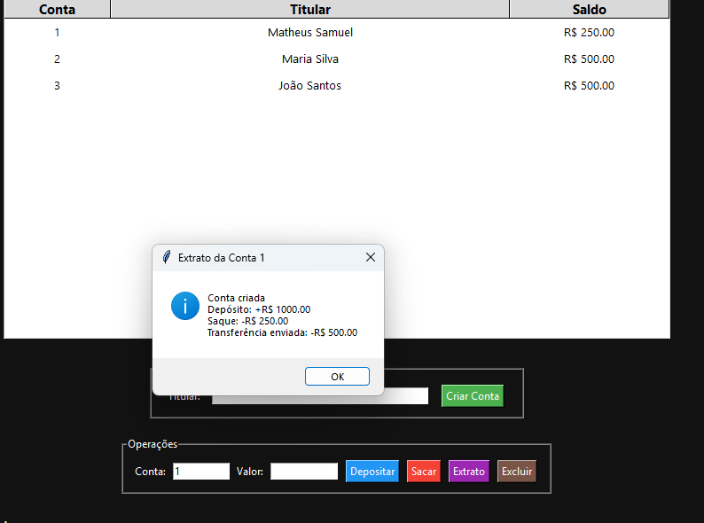

# 🏦 Sistema Bancário Desktop em Python

Sistema bancário desktop desenvolvido em **Python** utilizando **Tkinter** para interface gráfica e armazenamento de dados em **JSON**.

O projeto simula operações bancárias reais como criação de contas, depósitos, saques, transferências e consulta de extratos.

---

# 📸 Demonstração do Sistema

## 🏠 Tela Principal


A tela principal exibe todas as contas cadastradas, seus titulares e respectivos saldos, permitindo acesso rápido às funcionalidades do sistema.

---

## 🔄 Transferência entre Contas



Realização de transferências entre contas com atualização automática dos saldos e validação de dados.

---

## 📄 Extrato Bancário



Consulta detalhada do histórico de movimentações realizadas em cada conta.

---

# 🚀 Funcionalidades

### 👤 Gerenciamento de Contas

* Criar novas contas bancárias
* Excluir contas
* Visualizar contas cadastradas
* Atualização automática da tabela

### 💰 Operações Bancárias

* Depósito
* Saque
* Consulta de saldo
* Extrato bancário

### 🔄 Transferências

* Transferência entre contas
* Validação de saldo disponível
* Atualização automática dos valores

### 💾 Persistência de Dados

* Salvamento automático em JSON
* Recuperação dos dados ao iniciar o sistema
* Histórico de movimentações

---

# 🛠️ Tecnologias Utilizadas

* Python
* Tkinter
* JSON
* Programação Orientada a Objetos (POO)

---

# 📚 Conceitos Aplicados

Este projeto demonstra conhecimentos em:

* CRUD
* Orientação a Objetos
* Interfaces Gráficas Desktop
* Manipulação de Arquivos JSON
* Estruturas de Dados
* Tratamento de Exceções
* Regras de Negócio

---

# 📂 Estrutura do Projeto

```text
sistema-bancario-python/
│
├── app.py
├── banco.py
├── conta.py
├── dados.json
│
├── screenshots/
│   ├── tela-principal.png
│   ├── transferencia.png
│   └── extrato.png
│
├── .gitignore
└── README.md
```

---

# ⚙️ Como Executar

Clone o repositório:

```bash
git clone https://github.com/matheus-samuel-dev/sistema-bancario-python.git
```

Acesse a pasta:

```bash
cd sistema-bancario-python
```

Execute:

```bash
python app.py
```

---

# 🎯 Próximas Melhorias

* [ ] Sistema de Login
* [ ] Cadastro de Usuários
* [ ] Dashboard Financeiro
* [ ] Banco de Dados SQLite
* [ ] Exportação de Relatórios PDF
* [ ] Tema Escuro
* [ ] Histórico Avançado de Transações
* [ ] Controle de Permissões

---

# 👨‍💻 Desenvolvedor

## Matheus Samuel

Desenvolvedor Full Stack focado em desenvolvimento de aplicações, automação e criação de soluções utilizando Python, Java e tecnologias web.

### 🌐 Portfólio

https://matheus-samuel-dev.github.io/Portfolio/

### 💼 LinkedIn

https://www.linkedin.com/in/matheus-samuel-dev

### 🐙 GitHub

https://github.com/matheus-samuel-dev

---

⭐ Se este projeto foi útil ou interessante para você, considere deixar uma estrela no repositório.
