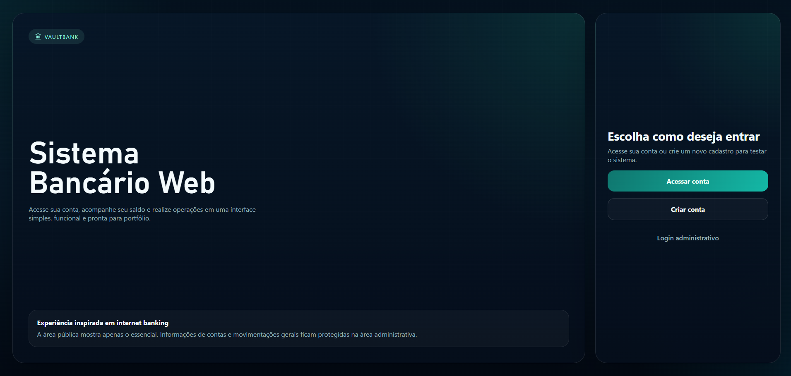
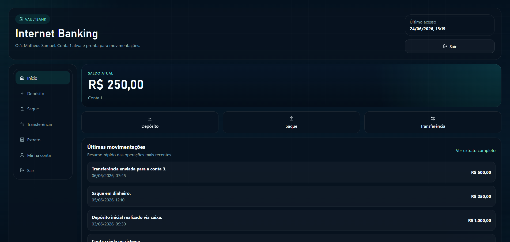
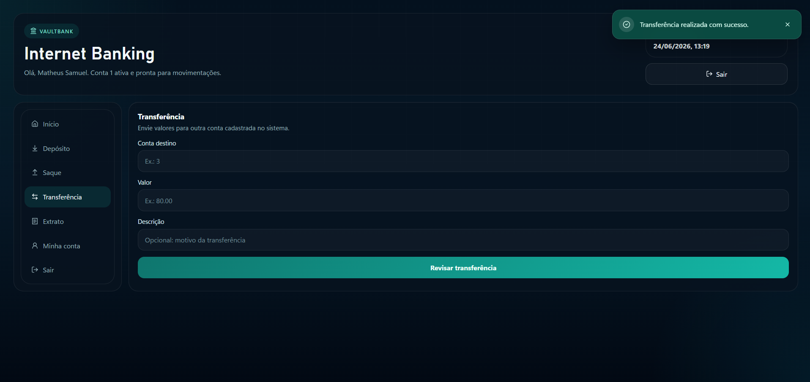
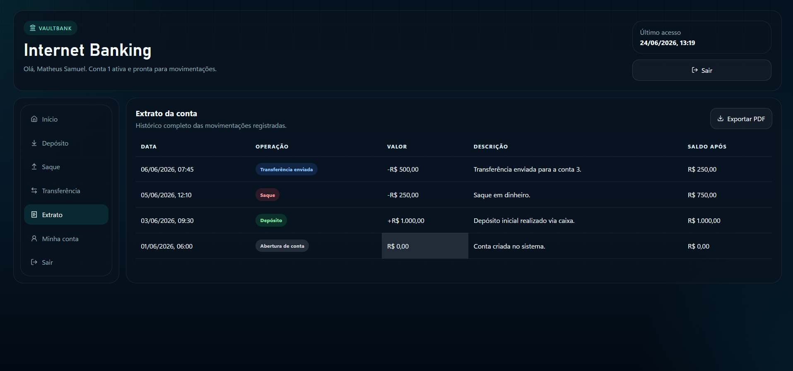
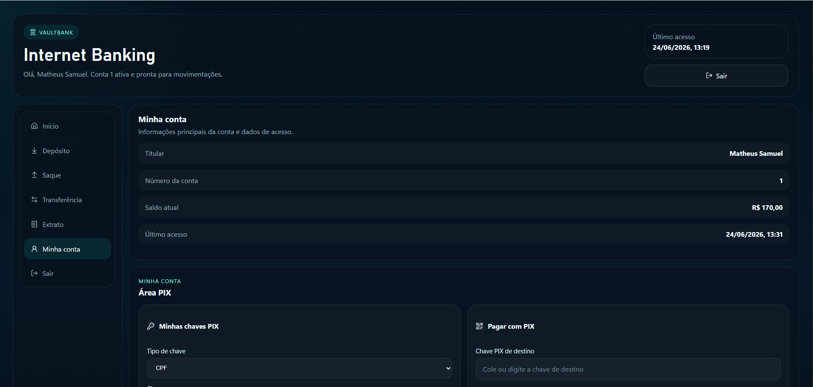
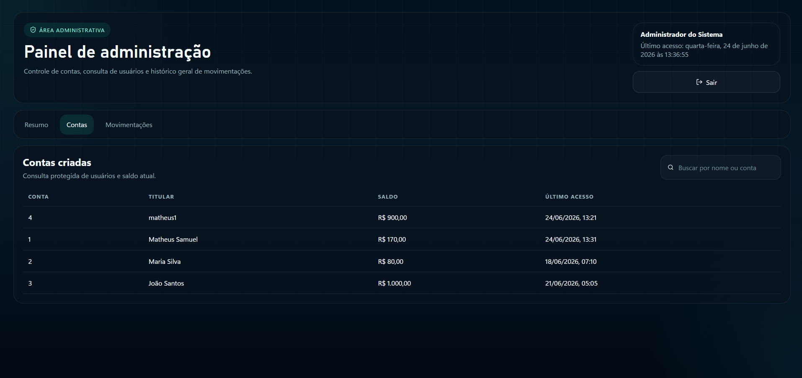

# 🏦 VaultBank - Sistema Bancário Web

<p align="center">
  
  &nbsp;
  
  &nbsp;
  
  &nbsp;
  
  &nbsp;
  
</p>

<p align="center">
  <strong>Simulação de um Internet Banking moderno desenvolvida para praticar conceitos de desenvolvimento web, regras de negócio bancárias e experiência do usuário.</strong>
</p>

<p align="center">
  <a href="https://sistema-bancario-python.vercel.app">🚀 Acessar Projeto Online</a>
</p>

<p align="center">
  <a href="https://github.com/matheus-samuel-dev">GitHub</a>
  &nbsp;&nbsp;&nbsp;
  <a href="https://linkedin.com/in/matheus-samuel-dev">LinkedIn</a>
  &nbsp;&nbsp;&nbsp;
  <a href="https://matheus-samuel-dev.github.io/Portfolio/">Portfólio</a>
</p>

---

# 📖 Sobre o Projeto

O VaultBank é uma aplicação web inspirada na experiência de um internet banking moderno.

O projeto surgiu a partir de uma versão desktop construída em Python e Tkinter e foi evoluído para uma aplicação web completa utilizando React e Vite, permitindo publicação online e uma experiência muito mais próxima de sistemas bancários reais.

O sistema permite gerenciamento de contas, movimentações financeiras, transferências, PIX, extrato detalhado e uma área administrativa protegida.

---

# 🚀 Projeto Online

Acesse a versão publicada:

🔗 https://sistema-bancario-python.vercel.app

---
=======
# Sistema Bancário Web

Versão web do projeto original em Python + Tkinter, recriada com React e Vite para publicação online e apresentação em portfólio.

O projeto desktop original foi preservado na pasta `Sistema-Bancario-Tkinter/`. A aplicação web está na raiz deste repositório.

# 🛠️ Tecnologias Utilizadas

### Front-end

* React
* Vite
* JavaScript ES6+

### Interface

* CSS Modules
* Lucide React

### Recursos

* LocalStorage
* jsPDF
* jspdf-autotable

### Deploy

* Vercel

---

# ✨ Funcionalidades

## 👤 Área do Cliente

* Criação de conta bancária
* Login com número da conta e senha
* Consulta de saldo
* Depósito
* Saque
* Transferência entre contas
* Cadastro de chave PIX
* Pagamento via PIX
* Histórico de transações
* Extrato detalhado
* Exportação de extrato em PDF

## 🛡️ Área Administrativa

* Login administrativo
* Consulta de usuários
* Histórico global de movimentações
* Visualização de contas cadastradas
* Busca por nome ou número da conta
* Controle geral do sistema
=======
- React 18
- Vite
- CSS Modules
- Lucide React
- Recharts
- jsPDF
- jspdf-autotable
- LocalStorage

## 📱 Interface

* Layout responsivo
* Dashboard moderno
* Feedback visual para operações
* Navegação intuitiva
* Experiência inspirada em internet banking

---

# 📸 Demonstração

| Tela Inicial                            | Dashboard                            |
| --------------------------------------- | ------------------------------------ |
|  |  |

| Transferência                            | Extrato                            |
| ---------------------------------------- | ---------------------------------- |
|  |  |

| Minha Conta                            | Painel Administrativo                            |
| -------------------------------------- | ------------------------------------------------ |
|  |  |

---

# 📋 Regras de Negócio

* Não permite depósito com valor negativo
* Não permite saque superior ao saldo
* Não permite transferência para a própria conta
* Não permite transferência para conta inexistente
* Não permite PIX sem saldo suficiente
* Registra automaticamente todas as operações
* Atualiza o saldo em tempo real
* Mantém histórico completo das movimentações
=======
- Tela pública com acesso à conta, criação de conta e login administrativo
- Dashboard do usuário com saldo, atalhos e últimas movimentações
- Depósito, saque e transferência entre contas
- Extrato com data, tipo, valor, descrição e saldo após cada operação
- Exportação do extrato em PDF
- Módulo demonstrativo de PIX
- Área administrativa com resumo geral, lista de contas e histórico global
- Feedback visual com mensagens de sucesso e erro
- Responsividade para mobile, tablet e desktop
- Favicon e manifesto configurados para navegador e instalação em dispositivos

## Regras de negócio

- Não permite depósito com valor zero ou negativo
- Não permite saque maior que o saldo disponível
- Não permite transferência maior que o saldo disponível
- Não permite transferência para conta inexistente
- Não permite transferência para a própria conta
- Registra todas as movimentações no extrato
- Atualiza o saldo automaticamente após cada operação
- Persiste os dados no `localStorage`

---

# 📂 Estrutura do Projeto

```text
src/
├── components/
├── pages/
├── services/
├── data/
├── utils/
├── styles/
└── assets/
```

---

# 🚀 Como Executar Localmente

### Clonar o repositório

```bash
git clone https://github.com/matheus-samuel-dev/sistema-bancario-python.git
```

### Instalar dependências

```bash
npm install
```

### Executar o projeto

```bash
npm run dev
```

### Gerar build
=======
```bash
npm install
npm run dev
```

Para gerar a build de produção:

```bash
npm run build
```

---

# 💡 Conceitos Aplicados

* Componentização
* Gerenciamento de estado
* Persistência local
* Boas práticas de UI/UX
* Responsividade
* Regras de negócio
* Organização de código
* Estruturação de projetos Front-end

---

# 🔮 Próximas Melhorias

- [ ] Criar uma API backend para persistência real dos dados
- [ ] Avaliar implementação do backend com Spring Boot ou Python/FastAPI
- [ ] Implementar banco de dados PostgreSQL
- [ ] Criar autenticação JWT
- [ ] Adicionar testes automatizados
- [ ] Criar dashboard financeiro com gráficos
- [ ] Gerar GIF demonstrativo para o README

---

# 🖥️ Versão Original Desktop

A versão inicial desenvolvida em Python + Tkinter foi preservada para fins de estudo e evolução do projeto.
=======
## Deploy na Vercel

1. Envie o repositório para o GitHub.
2. Importe o projeto na Vercel.
3. Use o preset `Vite`.
4. Confirme as configurações:

```bash
Build Command: npm run build
Output Directory: dist
```

5. Finalize o deploy.

## Contas de demonstração

- Conta `1` | Matheus Samuel | Senha `1234`
- Conta `2` | Maria Silva | Senha `1234`
- Conta `3` | João Santos | Senha `1234`

## Acesso administrativo

- Usuário: `admin`
- Senha: `admin123`

## Projeto original

```bash
cd Sistema-Bancario-Tkinter
python app.py
```

---

# 👨‍💻 Autor

## Matheus Samuel

Desenvolvedor focado em Back-end com Java e Spring Boot, apaixonado por desenvolvimento de software e construção de soluções que unem tecnologia, experiência do usuário e boas práticas de programação.

🔗 GitHub: https://github.com/matheus-samuel-dev

🔗 LinkedIn: https://linkedin.com/in/matheus-samuel-dev

🔗 Portfólio: https://matheus-samuel-dev.github.io/Portfolio/

---

⭐ Se gostou do projeto, considere deixar uma estrela no repositório.

